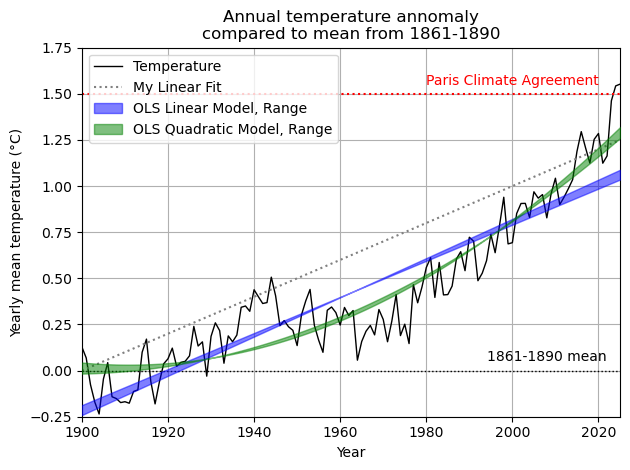
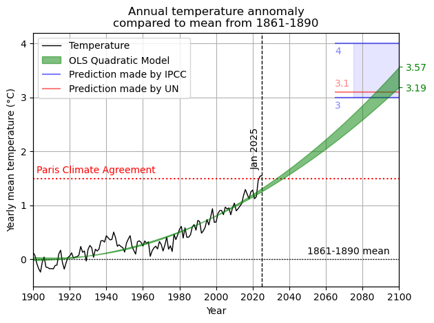

# A short analysis of climate data from 1900 to 2024 and a prediction of CO2 emissions until 2100

This project was created in the framework of a data analysis course at the Friedrich-Schiller-University of Jena. It analyses several data sets concerning CO2 emissions and disaster events worldwide, their correlation, and three different quantitative approaches and their resulting implications. Furthermore, it attempts to predict the future worldwide temperature increase up to the year 2100. Data from 1900 to 2024 is used for both the analysis and prediction.

The project finds a correlation between CO2 emissions and the number of disasters worldwide. Additionally, the project's predictions for the future average worldwide temperature in the year 2100 align with the official predictions published by the <b>IPCC ("Intergovernmental Panel on Climate Change")</b> and the UN <b>(EGR - "Emissions Gap Report")</b>.

This report focusses on the results of the project, while not covering the source code. The architecture is explained  in the video <a href="Presentation_SourceCode.mp4">Presentation_SourceCode</a>. Note that this video was excerpts of the presentation done for the submission of this project to the course, and was therefore not recorded to serve as part of this project report. However, the numerical modules and architecture used in the frame of this project are shown and explained to some degree.

## 1. Correlations between CO2 emissions and disasters

Open and run the script <b>main_disasters.py</b> with an IDE of your choice.

The script <b>main_disasters.py</b> reads the CO2-emissions and reported disasters from the year 1900 until the year 2024, and plots their distributions with different weights applied. For that, it uses the datasets in <b>project\DataSets</b>, that are taken from the website <a href="https://ourworldindata.org">Our World In Data</a>. The exact citations are given in <a href="#references">References</a>.

Under <a href="#11-results">Results</a>, the output of the script <b>main_disasters.py</b> is shown and analysed with regard to the calculations done to obtain the plots. A more detailed view on the data processing performed by <b>main_disasters.py</b> is provided under <a href="#12-data-processing">Data Processing</a>.

### Results

---

<table>
<tr>
<td width="50%" align="justify">

The first plot depicts all data in total quantities, showing a substantial increase in CO2 emissions alongside a significant growth in the number of disasters worldwide. The CO2 emissions are given as a total value as well, since this project focuses on their correlation with the appearance of disasters. The per-capita CO2 emissions are therefore not relevant in this context. However, the absolute data for both CO2 emissions and disasters makes it difficult to see the increase relative to the beginning of documentation. For this reason, a weighted modification of the data is needed for better representation.

</td>
<td width="50%">

</td>
</tr>
</table>

---

<table>
<tr>
<td width="50%" align="justify">

</td>
<td width="50%", align="justify">

The second plot depicts the same data normalized by the average values between 1900 and 1920 and therefore shows a percentage distribution of CO2 emissions and disasters. One can see that CO2 emissions increased by a factor of 13 from the beginning of the data set onward. Likewise, the number of disasters increased significantly as well, with floods showing an increase by a factor of around 150 in 2020. However, it is debatable whether the data shown actually depicts reality correctly, as those numbers appear much larger than one would assume. 
Since the data is a sum of all countries worldwide, an increase in documentation quantity and quality until 2024 might distort the data, so it might be beneficial to remove the effects of sparse data.

</td>
</tr>
</table>

---

<table>
<tr>
<td width="50%" align="justify">

There is no direct information about the availability of data during the covered time interval, so it is useful to look at effects that are evidently causally disconnected from CO2 emissions. Notably, the count of earthquake events rises with increasing CO2 emissions and therefore serves as a good indicator of data availability, as earthquakes can be assumed to be unaffected by CO2 emissions. Normalizing all data with the relative earthquake count from the second plot yields an approximation that may resemble reality more accurately. According to this approximation, floods appeared around 25 times more often than between 1900 and 1920.

</td>
<td width="50%">

</td>
</tr>
</table>

---
---

## 2. Prediction of CO2 emissions until the year 2100

The script <b>main_predictions.py</b> uses the module <b>statsmodels.formula.api.ols</b> to build a model for a given set of data, and uses it to make predictions on the CO2 emissions until the year 2100. As in <a href="#1-correlations-between-co2-emissions-and-disasters">section 1</a>, the data is taken from <a href="https://ourworldindata.org">Our World In Data</a>, with the exact citations given under <a href="#references">References</a>.

Under <a href="#21-results">Results</a>, the output of the script <b>main_predictions.py</b> is shown and analysed with regard to the calculations done to obtain the plots. A more detailed view on the data processing performed by <b>main_predictions.py</b> is provided under <a href="#22-data-processing">Data Processing</a>.

### Results

---

<table>
<tr>
<td width="50%" align="justify">

Three different models were applied and their goodness analysed for the temperature development since 1900. "My Linear Fit" is a linear model with parameters chosen by eye. The second linear and third quadratic models were created using the <b>"ols"</b> function of the Python module <b>"statsmodels"</b>, which returns a set of parameters for the fit. 
The goodness of all shown models is listed below. One can clearly see that the quadratic model fits the data best and is therefore used in the second step to attempt a prediction of the future temperature development up to 2100.

</td>
<td width="50%">

</td>
</tr>
</table>

<table width="100%">
<tr>
    <td width="25%" align="justify"
        style="background-color: #2d2d2d; border-right: 1px solid gray; border-bottom: 1px solid gray; border-top: 1px solid grey; border-left: 1px solid grey">
        model
    </td>
    <td width="25%"
        style="background-color: #2d2d2d; border-right: 1px solid gray; border-bottom: 1px solid gray; border-top: 1px solid grey">
        My Linear Fit
    </td>
    <td width="25%"
        style="background-color: #2d2d2d; border-right: 1px solid gray; border-bottom: 1px solid gray; border-top: 1px solid grey">
        OLS Linear Model
    </td>
    <td width="25%"
        style="background-color: #2d2d2d; border-bottom: 1px solid gray; border-top: 1px solid grey; border-right: 1px solid grey">
        OLS quadratic Model
    </td>
</tr>

<tr>
    <td width="25%" align="justify"
        style="background-color: #2d2d2d; border-right: 1px solid gray; border-bottom: 1px solid gray; border-left: 1px solid grey">
        RSS
    </td>
    <td width="25%"
        style="border-right: 1px solid gray; border-bottom: 1px solid gray;">
        8.8808
    </td>
    <td width="25%"
        style="border-right: 1px solid gray; border-bottom: 1px solid gray;">
        3.7778
    </td>
    <td width="25%"
        style="border-bottom: 1px solid gray; border-right: 1px solid grey">
        2.4059
    </td>
</tr>

<tr>
    <td width="25%" align="justify"
        style="background-color: #2d2d2d; border-right: 1px solid gray; border-bottom: 1px solid gray; border-left: 1px solid grey">
        RMSE
    </td>
    <td width="25%"
        style="border-right: 1px solid gray; border-bottom: 1px solid gray;">
        0.2655
    </td>
    <td width="25%"
        style="border-right: 1px solid gray; border-bottom: 1px solid gray;">
        0.1732
    </td>
    <td width="25%"
        style="border-bottom: 1px solid gray; border-right: 1px solid grey">
        0.1382
    </td>
</tr>

<tr>
    <td width="25%" align="justify"
        style="background-color: #2d2d2d; border-right: 1px solid gray; border-bottom: 1px solid gray; border-left: 1px solid grey">
        RSquared
    </td>
    <td width="25%"
        style="border-right: 1px solid gray; border-bottom: 1px solid gray;">
        0.5800
    </td>
    <td width="25%"
        style="border-right: 1px solid gray; border-bottom: 1px solid gray;">
        0.8213
    </td>
    <td width="25%"
        style="border-bottom: 1px solid gray; border-right: 1px solid grey">
        0.8862
    </td>
</tr>
</table>

---

<table>
<tr>
<td width="50%" align="justify">

</td>
<td width="50%", align="justify">

Using the <b>OLS Quadratic Model</b>, one can extrapolate the fit to predict the temperature development, in this case up until the year 2100. As apparent, the error of the model increases over time but remains quite small compared to the official estimations made by the <b>IPCC (Intergovernmental Panel on Climate Change)</b> of 3°C to 4°C. Notably, the <b>OLS Quadratic Model</b> predicts a temperature within the IPCC estimation range. Additionally, another estimation from the <b>Emission Gap Report</b> issued by the UN gives 3.1°C, which is even more optimistic than the <b>OLS Quadratic Model</b> but close to its prediction range. 
It is important to note that the <b>OLS Quadratic Model</b> is based on prior temperature data and does not take any additional effects into account that might significantly alter the future development.

</td>
</tr>
</table>

---
---

## References

<table width="100%">
<tr>
    <td width="25%" align="justify"
        style="background-color: #2d2d2d; border-right: 1px solid gray; border-bottom: 1px solid gray; border-top: 1px solid grey; border-left: 1px solid grey">
        DataFrame (file)
    </td>
    <td width="25%"
        style="background-color: #2d2d2d; border-right: 1px solid gray; border-bottom: 1px solid gray; border-top: 1px solid grey">
        URL
    </td>
    <td width="25%"
        style="background-color: #2d2d2d; border-right: 1px solid gray; border-bottom: 1px solid gray; border-top: 1px solid grey">
        Date, Time
    </td>
</tr>
<tr>
    <td width="25%" align="justify"
        style="background-color: #2d2d2d; border-right: 1px solid gray; border-bottom: 1px solid gray; border-left: 1px solid grey">
        co2PerCapita_combi.csv co2PerCapita_landuse.csv
    </td>
    <td width="25%"
        style="border-right: 1px solid gray; border-bottom: 1px solid gray; overflow-wrap: anywhere; word-break: break-word">
        https://ourworldindata.org/co2-and-greenhouse-gas-emissions#explore-data-on-co2-and-greenhouse-gas-emissions
    </td>
    <td width="25%"
        style="border-right: 1px solid gray; border-bottom: 1px solid gray;">
        15.09.2025, 12:00
    </td>
</tr>
<tr>
    <td width="25%" align="justify"
        style="background-color: #2d2d2d; border-right: 1px solid gray; border-bottom: 1px solid gray; border-left: 1px solid grey">
        population.csv
    </td>
    <td width="25%"
        style="border-right: 1px solid gray; border-bottom: 1px solid gray; overflow-wrap: anywhere; word-break: break-word">
        https://ourworldindata.org/grapher/population#explore-the-data
    </td>
    <td width="25%"
        style="border-right: 1px solid gray; border-bottom: 1px solid gray;">
        15.09.2025, 13:00
    </td>
</tr>
<tr>
    <td width="25%" align="justify"
        style="background-color: #2d2d2d; border-right: 1px solid gray; border-bottom: 1px solid gray; border-left: 1px solid grey">
        meanTemp_world.csv
    </td>
    <td width="25%"
        style="border-right: 1px solid gray; border-bottom: 1px solid gray; overflow-wrap: anywhere; word-break: break-word">
        https://ourworldindata.org/explorers/climate-change?Metric=Temperature+anomaly&Long-run+series=false&country=ATA~Gulkana+Glacier~Lemon+Creek+Glacier~OWID_NAM~South+Cascade+Glacier~Wolverine+Glacier~Hawaii~Arctic+Ocean~OWID_WRL
    </td>
    <td width="25%"
        style="border-right: 1px solid gray; border-bottom: 1px solid gray;">
        21.09.2025, 17:00
    </td>
</tr>
<tr>
    <td width="25%" align="justify"
        style="background-color: #2d2d2d; border-right: 1px solid gray; border-bottom: 1px solid gray; border-left: 1px solid grey">
        meanTemp_perCountry.csv
    </td>
    <td width="25%"
        style="border-right: 1px solid gray; border-bottom: 1px solid gray; overflow-wrap: anywhere; word-break: break-word">
        https://ourworldindata.org/grapher/annual-temperature-anomalies?time=latest
    </td>
    <td width="25%"
        style="border-right: 1px solid gray; border-bottom: 1px solid gray;">
        23.09.2025, 13:00
    </td>
</tr>
<tr>
    <td width="25%" align="justify"
        style="background-color: #2d2d2d; border-right: 1px solid gray; border-bottom: 1px solid gray; border-left: 1px solid grey">
        disasters.csv
    </td>
    <td width="25%"
        style="border-right: 1px solid gray; border-bottom: 1px solid gray; overflow-wrap: anywhere; word-break: break-word">
        https://ourworldindata.org/grapher/number-of-natural-disaster-events?country=Flood~Extreme+weather~Earthquake
    </td>
    <td width="25%"
        style="border-right: 1px solid gray; border-bottom: 1px solid gray;">
        23.09.2025, 13:00
    </td>
</tr>
</table>
