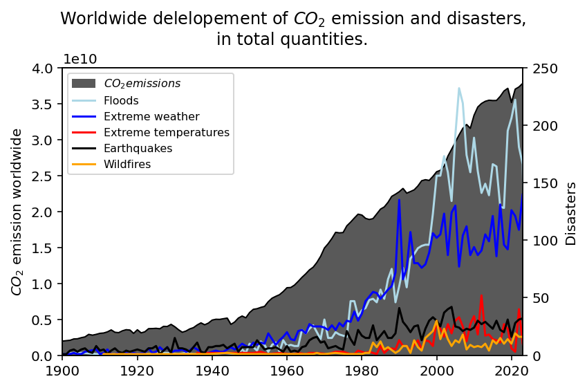
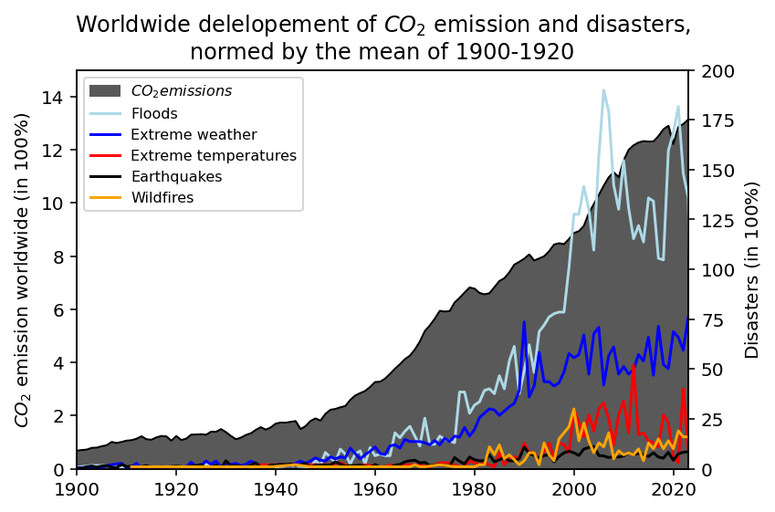
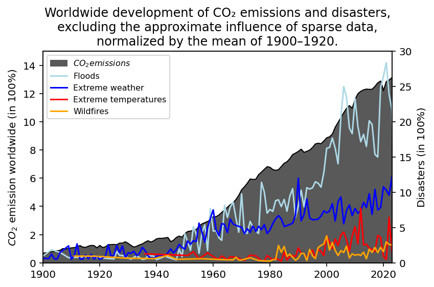

# A short analysis issuing climate data from 1900 until 2024, and prediction of CO2 emission until 2100

This project was create in the frame of an data analysis course of the Friedrich-Schiller-University of Jena. It analyses several sets of data concerning the CO2 emission and events of disasters worldwide regarding their correlation and explores three different quantitative approaches and their resulting corresponding implications. Furthermore it attempts to predict the future worldwide temperature increase up to the year 2100. Data from the year 1900 until 2024 is used for both the analysis and prediction.

The project finds correlation between the CO2 emission and the amount of disasters worldwide. Additionally, the projects predictions for the future average worldwide temerpature for the year 2100 align with the official predictions published by the <b>IPCC ("Intergovernmental Panel on Climate Change")</b> and the UN <b>(EGR - "Emissions Gap Report")</b>.

## 1. Correlations between CO2 emissions and disasters

Open and run the script <b>main_disasters.py</b> with an IDE of your choice.

The script <b>main_disasters.py</b> reads the CO2-emissions and reported disasters from the year 1900 until the year 2024, and plots their distributions with different weights applied. For that, it uses the datasets in <b>project\DataSets</b>, that are taken from the website <a href="https://ourworldindata.org">Our World In Data</a>. The exact citations are given in <a href="#references">References</a>.

Under <a href="#11-results">Results</a>, the output of the script <b>main_disasters.py</b> is shown and analysed with regard to the calculations done to obtain the plots. A more detailed view on the data processing performed by <b>main_disasters.py</b> is provided under <a href="#12-data-processing">Data Processing</a>.

### 1.1 Results

---

<table>
<tr>
<td width="50%" align="justify">

The first plot depicts all data in total quantities, showing a substantial increase in CO2 emission alongside an significant growth of the number of disasters worldwide. The CO2 emissions are given as total value as well, as this projects focusses on their correlation with the appearance of disasters. The per-capita CO2 emission is therefore not relevant in this context. However, the absolute data of both CO2 emissions and disasters makes it hard to see the increase of numbers relative to the beginning of documentation. For that, a weighted modification of the data for a better representation is needed. 

</td>
<td width="50%">

</td>
</tr>
</table>

---

<table>
<tr>
<td width="50%" align="justify">

</td>
<td width="50%", align="justify">

The second plot depicts the same data normed by the average values between the years 1900 and 1920, and therefore depicts a procentual distribution of CO2 emission and disasters. One can see, that the CO2 emission increased by a factor of 13 from the beginning of the data sets onwards. Likewise, the amount of disasters increased significantly as well, with the floods showning an increase of a factor of around 150 in the year 2020. Hoever, it is debatable wether the data shown does depict the reality correctly, as those numbers appear to be way larger than one would assume. 
Since the data is a summation of all countries worldwide, an increase in documentation quantity and quality until 2024 might distort the data, so is might be beneficial to remove the effects of sparse data.

</td>
</tr>
</table>

---

<table>
<tr>
<td width="50%" align="justify">

There are no direct information about the availablility of data during the covered time interval, so it is useful to look at effects, that are evidently causaly disconnected from the CO2 emissions. Notably, the count of earthquake events rises with increasing CO2 emissions, and therefore is a good indicator for the availability of data, as earthquakes can be assumed to be unaffected by CO2 emissions. Normalizing all data with the relative earthquake count from the second plot, one now obtains an approximation that may resemble the reality more accuratly. According to this approximation, floods appeared around 25 times more often than between the years 1900 and 1920. 

</td>
<td width="50%">

</td>
</tr>
</table>

---

### 1.2 Data Processing

---

... data processing ...

## 2. Prediction of CO2 emissions until the year 2100

The script <b>main_predictions.py</b> uses the module <b>statsmodels.formula.api.ols</b> to build a model for a given set of data, and uses it to make predictions on the CO2 emissions until the year 2100. As in <a href="#1-correlations-between-co2-emissions-and-disasters">section 1</a>, the data is taken from <a href="https://ourworldindata.org">Our World In Data</a>, with the exact citations given under <a href="#references">References</a>.

Under <a href="#21-results">Results</a>, the output of the script <b>main_predictions.py</b> is shown and analysed with regard to the calculations done to obtain the plots. A more detailed view on the data processing performed by <b>main_predictions.py</b> is provided under <a href="#22-data-processing">Data Processing</a>.

### 2.1 Results

---

... results ...

### 2.2 Data Processing

---

--- data processing ...

## References

... references ...